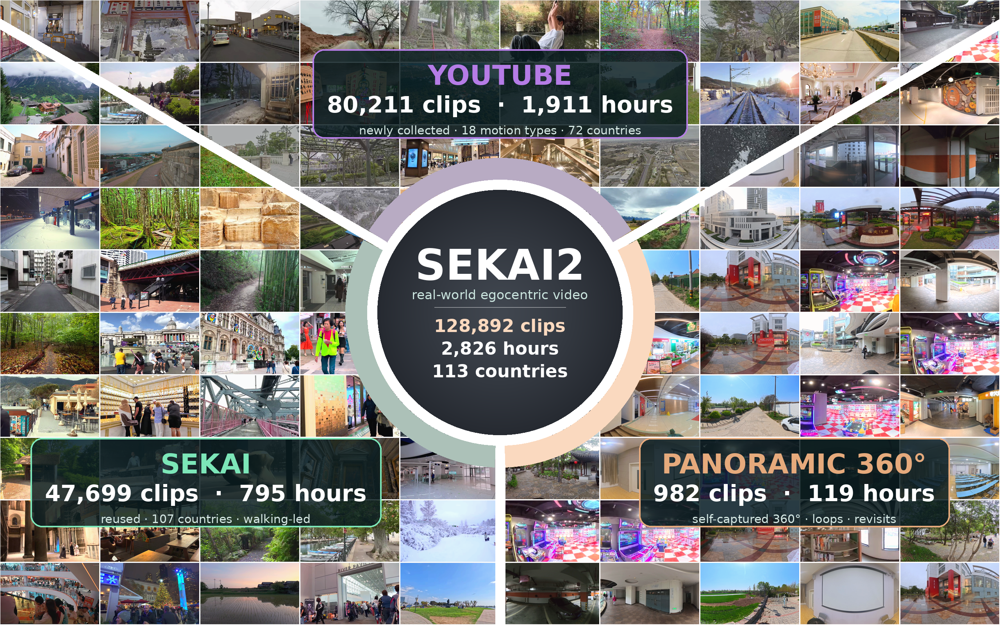

# Sekai2: From World Exploration to Interactive World Modeling

<p align="center">
  <a href="https://kangverse.github.io/sekai2-project/"></a>
  <a href="https://arxiv.org/abs/2608.09449"></a>
  <a href="https://huggingface.co/datasets/Kangverse/Sekai2_Real_World"></a>
  <a href="https://www.modelscope.ai/datasets/kangverse/Sekai2_Panoramics/files"></a>
</p>

<p align="center">
  
</p>

> A large-scale, real-world egocentric video dataset for interactive world
> modeling, pairing long-horizon footage across diverse modes of movement with
> camera trajectories and structured, temporally grounded language.

---

## 📰 News

- **[2026-09-09] Sekai2 data released!** The metadata and paired camera-pose/caption annotations for **127,884 perspective clips** are now available on [🤗 Hugging Face](https://huggingface.co/datasets/Kangverse/Sekai2_Real_World), and a **20-hour 360° panoramic subset (173 videos)** is available on [ModelScope](https://www.modelscope.ai/datasets/kangverse/Sekai2_Panoramics/files). The new v2 perspective pose release includes camera intrinsics and camera-to-world transforms.
- **[2026-08-14] Sekai2 technical report released.** Read the paper on [arXiv](https://arxiv.org/abs/2608.09449) and visit the [project page](https://kangverse.github.io/sekai2-project/).

## The dataset at a glance

The complete dataset described in the paper contains:

| | |
|---|---:|
| Clips | **128,892** |
| Footage | **2,826 hours** |
| Countries and regions | **113** |
| Temporally grounded segments | **649,597** (5.04 per clip, 15 s median) |

The current public release contains 128,057 entries. Perspective videos are
represented by reproducible URL/timestamp metadata and paired annotations;
the 20-hour panoramic subset is distributed as full videos.

| Source | Paper corpus | Public release | Released at |
|---|---:|---:|---|
| Inherited Sekai | 47,699 | 47,699 | [Hugging Face](https://huggingface.co/datasets/Kangverse/Sekai2_Real_World) |
| Newly collected YouTube | 80,211 | 80,185 | [Hugging Face](https://huggingface.co/datasets/Kangverse/Sekai2_Real_World) |
| Panoramic (self-captured) | 982 | 173 (20 hours) | [ModelScope](https://www.modelscope.ai/datasets/kangverse/Sekai2_Panoramics/files) |
| **Total** | **128,892** | **128,057** | |

Each clip is accompanied by:

- **Camera pose**—per-frame trajectories produced by a geometry pipeline and
  validated against the images.
- **Clip-level annotation**—factorized description fields covering the scene,
  what moves, and how the camera behaves.
- **Grounded segments**—time ranges, short prompts, and camera-path labels.
- **Controlled attributes**—country, camera motion, lighting, time of day,
  weather, and scene type.

## Download

### Perspective data and annotations

The perspective release is hosted at
[Kangverse/Sekai2_Real_World](https://huggingface.co/datasets/Kangverse/Sekai2_Real_World).
To download it with the Hugging Face CLI:

```bash
pip install -U huggingface_hub
hf download Kangverse/Sekai2_Real_World \
  --repo-type dataset \
  --local-dir Sekai2_Real_World
```

The repository provides:

- `sekai2_clips.csv`: source URLs and exact frame ranges for 127,884
  reconstructable perspective clips.
- `sekai2_dataset.csv`: the complete public manifest, including the panoramic
  subset.
- `annotations-v2/sekai/`: 47,699 paired Sekai pose/caption annotations.
- `annotations-v2/sekai2/`: 80,185 paired Sekai2 pose/caption annotations.
- `metadata/`: active shard checksums and release metadata, with immutable
  versioned copies under `metadata/v1/` and `metadata/v2/`.

The perspective MP4 clips are not redistributed. Each row of
`sekai2_clips.csv` records the source URL and the exact half-open frame range
`[start_frame, end_frame)` in a canonical 30 fps time base, allowing the clip
used by the released annotations to be reconstructed frame-accurately.

### Panoramic data

The self-captured **20-hour 360° panoramic subset** is hosted as full videos at
[kangverse/Sekai2_Panoramics on ModelScope](https://www.modelscope.ai/datasets/kangverse/Sekai2_Panoramics/files).
These videos are distributed directly and do not use the URL/timestamp
reconstruction procedure above.

## Utilities

This repository includes the same release utilities distributed with the
Hugging Face dataset:

```text
data_tools/
├── reconstruct_clips.py     # download sources and reconstruct exact clips
├── extract_annotations.py   # extract one paired pose/caption annotation
└── requirements.txt
```

Install the Python dependencies and make sure `ffmpeg` and `ffprobe` are
available on your system:

```bash
pip install -r data_tools/requirements.txt
```

Reconstruct perspective clips from the public manifest. The example below
downloads source videos, reconstructs ten `sekai2` clips, and validates their
resolution, frame rate, and exact frame count:

```bash
python data_tools/reconstruct_clips.py \
  /path/to/Sekai2_Real_World/sekai2_clips.csv \
  --output-dir ./data/clips \
  --cache-dir ./data/source-cache \
  --dataset sekai2 \
  --limit 10
```

Use one or more `--clip-id <clip_id>` arguments instead of `--limit` to select
specific clips. Add `--remove-source` if cached source videos should be deleted
after all selected clips from that source have been reconstructed.

After downloading the relevant annotation shard, extract the paired NPZ and
JSON files for one clip:

```bash
python data_tools/extract_annotations.py \
  /path/to/Sekai2_Real_World/sekai2_clips.csv \
  --repo-root /path/to/Sekai2_Real_World \
  --clip-id <clip_id> \
  --output-dir ./data/annotations
```

## Annotation format

Each perspective annotation shard is a tar archive containing paired files:

```text
pose/<clip_stem>.npz
caption/<clip_stem>.json
```

Two annotation versions are retained:

- `annotations/` is the legacy **v1** release. Its pose files do not include
  camera intrinsics.
- `annotations-v2/` is the current **v2** release. The root CSV manifests point
  to this version, whose pose files contain both camera intrinsics and
  camera-to-world transforms.

The v2 pose NPZ format is:

```python
intrinsics  # (T, 3, 3), float32
cam_c2w     # (T, 4, 4), float32
```

`T` is the number of trajectory samples for a clip and may vary between clips;
the two arrays always have the same `T`.

The previous `annotations/` tree remains available for compatibility. For new
projects, use `annotations-v2/` together with the root CSV manifests and
`metadata/v2/`.

## Citation

If you find Sekai2 useful in your research, please cite:

```bibtex
@article{he2026sekai2,
  title   = {Sekai2: From World Exploration to Interactive World Modeling},
  author  = {He, Kang and Peng, Wenshuo and Gao, Zihui and Tan, Jiaming and
             Zhang, Kaipeng and Ge, Yongtao},
  journal = {arXiv preprint arXiv:2608.09449},
  year    = {2026}
}
```

## License and responsible use

**For academic research and non-commercial use only.**

Please refer to the terms provided in the corresponding
[Hugging Face](https://huggingface.co/datasets/Kangverse/Sekai2_Real_World)
and [ModelScope](https://www.modelscope.ai/datasets/kangverse/Sekai2_Panoramics/files)
repositories. Source videos, metadata, and annotations may be governed by
different terms. Users are responsible for complying with the licenses and
terms of the original video platforms and content owners.
